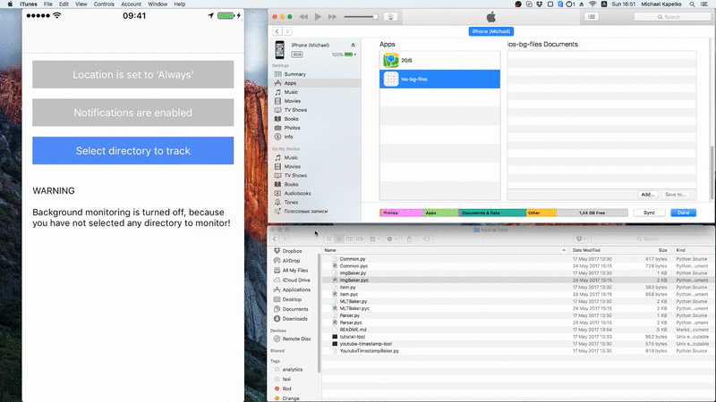

# Overview

This is a sample iOS application to monitor directory changes in the background.

# Video

The video depicts adding/removing files using iTunes File sharing feature. iPhone is running iOS10.

[YouTube video](https://youtu.be/TtOMlzdXXL8)

# Preview

Here's a short preview if you can't open YouTube for some reason:

# Details

* Background execution is achieved by requesting 'Always' location updates.
* File changes are tracked with GCD descriptor dispatch source.
* Notifications are reported using local notifications.

# Things to improve

There are a few things that can be improved. However, since this is only a sample, they are left out.

* Waiting for changes to finish. There are several use cases where reporting right away does not make much sense
  * When several files are added or removed, there is a notification for each one of them
  * When a large file is added, notification is reported before the file has been uploaded

* Supporting UNUserNotificationCenter
  * UILocalNotification is deprecated in iOS10, but still works
  * `NotificationWithLNAndUNC` directory contains an attempt to use UNC if it's supported, but since the async nature of `UNUserNotificationCenter getNotificationSettingsWithCompletionHandler:` ruins the pretty interface of `Notification` class, I decided to stay with UILocalNotification

# References

Here are some of the docs I used to implement the sample.

* Directory monitoring with GCD
  * https://habrahabr.ru/post/191868/
  * https://www.cocoanetics.com/2013/08/monitoring-a-folder-with-gcd/
* iOS background execution
  * https://habrahabr.ru/post/271505/
  * https://github.com/vaskravchuk/BGModesTest
